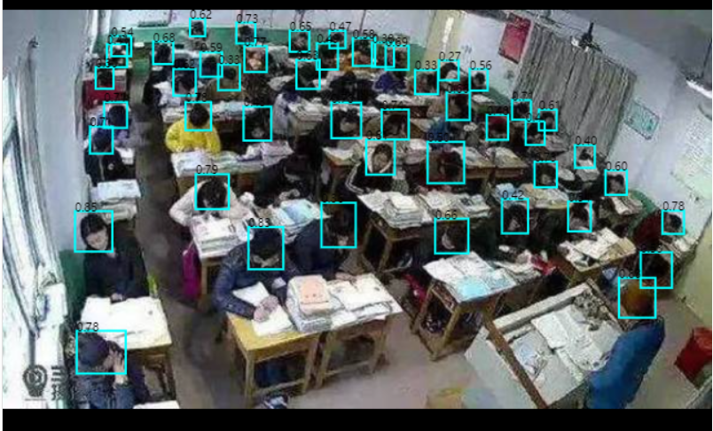

## <div align="center">关于本仓库</div>

- 说明
  - 基础环境：[YOLOv5](https://github.com/ultralytics/yolov5) `yolov5s`
  - 训练数据： [HEAD-Dataset](https://github.com/HCIILAB/SCUT-HEAD-Dataset-Release)（某高校监控图 2000 张，网络收集 2400 张）
  - 训练环境：租用 [AutoDl](https://www.autodl.com/home) 云服务器所提供的`yolov5` 环境 `ubuntu` `RTX2080TI 11G`
  - 训练结果：[image](./runs/train/exp/val_batch0_labels.jpg) [charts](./runs/train/exp/results.png)
  - 使用`tfjs`部署在网页 [person-count](https://person-count.netlify.app) (图片推断于本地进行,模型大小为 22M)
  - 本地推断：`python detect.py --weights runs/train/exp3/weights/best.pt`
    
    <br>
- 使用（推荐云服务器环境）
  - 环境克隆
    ```bash
    git clone https://gitee.com/winnerlosser/yolo.git  # 克隆
    cd yolo
    pip install -r requirements.txt  # 安装
    ```
  - 数据下载
    已经过数据格式转换与数据筛查：[阿里云盘](https://www.aliyundrive.com/s/XVmtThMd8zf)（自解压文件）
    <br>
  - 训练
    - 先将数据解压至该目录
    - 本地训练需先安装`cuda` https://pytorch.org/get-started/previous-versions/
    ```bash
    python train.py --data data.yaml --cfg yolo.yaml --weights yolov5s.pt --epochs 50  --batch-size 16 --device 0
      - data data/data.yaml # 训练数据集的位置，分类
      - cfg models/yolo.yaml # 训练参数 仅更改 nc
      - weights yolov5s # 预训练权重 可加快训练速度
      - epochs number # 训练轮数
      - batch-size # 该值依机器性能而定，越大所需要的gpu显存越多,以我本机为例（GTX1050 3G）仅能设置为2
      - device # cup(不推荐) | 0(单gpu训练)| 0,1,2(多gpu训练)
    ```
  - 训练完成的结果位于 runs/train/
  - 模型格式转换请参考 export.py 中的命令

<br>
## <div align="center">官方</div>

<div align="center">
  <p>
    <a align="center" href="https://ultralytics.com/yolov5" target="_blank">
      </a>
  </p>

  <br>
   <p>
   YOLOv5🚀是一个在COCO数据集上预训练的物体检测架构和模型系列，它代表了<a href="https://ultralytics.com">Ultralytics</a>对未来视觉AI方法的公开研究，其中包含了在数千小时的研究和开发中所获得的经验和最佳实践。
   </p>

## <div align="center">文件</div>

请参阅[YOLOv5 Docs](https://docs.ultralytics.com)，了解有关训练、测试和部署的完整文件。

## <div align="center">快速开始案例</div>

<details open>
<summary>安装</summary>

在[**Python>=3.7.0**](https://www.python.org/) 的环境中克隆版本仓并安装 [requirements.txt](https://github.com/ultralytics/yolov5/blob/master/requirements.txt)，包括[**PyTorch>=1.7**](https://pytorch.org/get-started/locally/)。

```bash
git clone https://github.com/ultralytics/yolov5  # 克隆
cd yolov5
pip install -r requirements.txt  # 安装
```

</details>

<details open>
<summary>推理</summary>

YOLOv5 [PyTorch Hub](https://github.com/ultralytics/yolov5/issues/36) 推理. [模型](https://github.com/ultralytics/yolov5/tree/master/models) 自动从最新 YOLOv5 [版本](https://github.com/ultralytics/yolov5/releases)下载。

```python
import torch

# 模型
model = torch.hub.load('ultralytics/yolov5', 'yolov5s')  # or yolov5n - yolov5x6, custom

# 图像
img = 'https://ultralytics.com/images/zidane.jpg'  # or file, Path, PIL, OpenCV, numpy, list

# 推理
results = model(img)

# 结果
results.print()  # or .show(), .save(), .crop(), .pandas(), etc.
```

</details>

<details>
<summary>用 detect.py 进行推理</summary>

`detect.py` 在各种数据源上运行推理, 其会从最新的 YOLOv5 [版本](https://github.com/ultralytics/yolov5/releases) 中自动下载 [模型](https://github.com/ultralytics/yolov5/tree/master/models) 并将检测结果保存到 `runs/detect` 目录。

```bash
python detect.py --source 0  # 网络摄像头
                          img.jpg  # 图像
                          vid.mp4  # 视频
                          path/  # 文件夹
                          'path/*.jpg'  # glob
                          'https://youtu.be/Zgi9g1ksQHc'  # YouTube
                          'rtsp://example.com/media.mp4'  # RTSP, RTMP, HTTP 流
```

</details>

<details>
<summary>训练</summary>

以下指令再现了 YOLOv5 [COCO](https://github.com/ultralytics/yolov5/blob/master/data/scripts/get_coco.sh)
数据集结果. [模型](https://github.com/ultralytics/yolov5/tree/master/models) 和 [数据集](https://github.com/ultralytics/yolov5/tree/master/data) 自动从最新的 YOLOv5 [版本](https://github.com/ultralytics/yolov5/releases) 中下载。YOLOv5n/s/m/l/x 的训练时间在 V100 GPU 上是 1/2/4/6/8 天（多 GPU 倍速）. 尽可能使用最大的 `--batch-size`, 或通过 `--batch-size -1` 来实现 YOLOv5 [自动批处理](https://github.com/ultralytics/yolov5/pull/5092). 批量大小显示为 V100-16GB。

```bash
python train.py --data coco.yaml --epochs 300 --weights '' --cfg yolov5n.yaml  --batch-size 128
                                                                 yolov5s                    64
                                                                 yolov5m                    40
                                                                 yolov5l                    24
                                                                 yolov5x                    16
```


</details>

<details open>
<summary>教程</summary>

- [训练自定义数据集](https://github.com/ultralytics/yolov5/wiki/Train-Custom-Data) 🚀 推荐
- [获得最佳训练效果的技巧](https://github.com/ultralytics/yolov5/wiki/Tips-for-Best-Training-Results) ☘️
  推荐
- [多 GPU 训练](https://github.com/ultralytics/yolov5/issues/475)
- [PyTorch Hub](https://github.com/ultralytics/yolov5/issues/36) 🌟 新
- [TFLite, ONNX, CoreML, TensorRT 输出](https://github.com/ultralytics/yolov5/issues/251) 🚀
- [测试时数据增强 (TTA)](https://github.com/ultralytics/yolov5/issues/303)
- [模型集成](https://github.com/ultralytics/yolov5/issues/318)
- [模型剪枝/稀疏性](https://github.com/ultralytics/yolov5/issues/304)
- [超参数进化](https://github.com/ultralytics/yolov5/issues/607)
- [带有冻结层的迁移学习](https://github.com/ultralytics/yolov5/issues/1314)
- [架构概要](https://github.com/ultralytics/yolov5/issues/6998) 🌟 新
- [使用 Weights & Biases 记录实验](https://github.com/ultralytics/yolov5/issues/1289)
- [Roboflow：数据集，标签和主动学习](https://github.com/ultralytics/yolov5/issues/4975) 🌟 新
- [使用 ClearML 记录实验](https://github.com/ultralytics/yolov5/tree/master/utils/loggers/clearml) 🌟 新
- [Deci 平台](https://github.com/ultralytics/yolov5/wiki/Deci-Platform) 🌟 新

</details>

## <div align="center">Integrations</div>

<br>
<a align="center" href="https://bit.ly/ultralytics_hub" target="_blank">
</a>
<br>
<br>

<div align="center">
  <a href="https://roboflow.com/?ref=ultralytics">
    </a>
  
  <a href="https://cutt.ly/yolov5-readme-clearml">
    </a>
  
  <a href="https://bit.ly/yolov5-readme-comet">
    </a>
  
  <a href="https://bit.ly/yolov5-deci-platform">
    </a>
</div>

|                                                           Roboflow                                                           |                                                           ClearML ⭐ NEW                                                            |                                                                       Comet ⭐ NEW                                                                        |                                                              Deci ⭐ NEW                                                               |
| :--------------------------------------------------------------------------------------------------------------------------: | :---------------------------------------------------------------------------------------------------------------------------------: | :-------------------------------------------------------------------------------------------------------------------------------------------------------: | :------------------------------------------------------------------------------------------------------------------------------------: |
| Label and export your custom datasets directly to YOLOv5 for training with [Roboflow](https://roboflow.com/?ref=ultralytics) | Automatically track, visualize and even remotely train YOLOv5 using [ClearML](https://cutt.ly/yolov5-readme-clearml) (open-source!) | Free forever, [Comet](https://bit.ly/yolov5-readme-comet) lets you save YOLOv5 models, resume training, and interactively visualise and debug predictions | Automatically compile and quantize YOLOv5 for better inference performance in one click at [Deci](https://bit.ly/yolov5-deci-platform) |

## <div align="center">Ultralytics HUB</div>

[Ultralytics HUB](https://bit.ly/ultralytics_hub) is our ⭐ **NEW** no-code solution to visualize datasets, train YOLOv5 🚀 models, and deploy to the real world in a seamless experience. Get started for **Free** now!

<a align="center" href="https://bit.ly/ultralytics_hub" target="_blank">

## <div align="center">为什么选择 YOLOv5</div>

<p align="left"></p>
<details>
  <summary>YOLOv5-P5 640 图像 (点击扩展)</summary>

<p align="left"></p>
</details>
<details>
  <summary>图片注释 (点击扩展)</summary>

- **COCO AP val** 表示 mAP@0.5:0.95 在 5000 张图像的[COCO val2017](http://cocodataset.org)数据集上，在 256 到 1536 的不同推理大小上测量的指标。
- **GPU Speed** 衡量的是在 [COCO val2017](http://cocodataset.org) 数据集上使用 [AWS p3.2xlarge](https://aws.amazon.com/ec2/instance-types/p3/) V100 实例在批量大小为 32 时每张图像的平均推理时间。
- **EfficientDet** 数据来自 [google/automl](https://github.com/google/automl) ，批量大小设置为 8。
- 复现 mAP 方法: `python val.py --task study --data coco.yaml --iou 0.7 --weights yolov5n6.pt yolov5s6.pt yolov5m6.pt yolov5l6.pt yolov5x6.pt`

</details>

### 预训练检查点

| 模型                                                                                                 | 规模<br><sup>(像素) | mAP<sup>验证<br>0.5:0.95 | mAP<sup>验证<br>0.5 | 速度<br><sup>CPU b1<br>(ms) | 速度<br><sup>V100 b1<br>(ms) | 速度<br><sup>V100 b32<br>(ms) | 参数<br><sup>(M) | 浮点运算<br><sup>@640 (B) |
| ---------------------------------------------------------------------------------------------------- | ------------------- | ------------------------ | ------------------- | --------------------------- | ---------------------------- | ----------------------------- | ---------------- | ------------------------- |
| [YOLOv5n](https://github.com/ultralytics/yolov5/releases/download/v6.1/yolov5n.pt)                   | 640                 | 28.0                     | 45.7                | **45**                      | **6.3**                      | **0.6**                       | **1.9**          | **4.5**                   |
| [YOLOv5s](https://github.com/ultralytics/yolov5/releases/download/v6.1/yolov5s.pt)                   | 640                 | 37.4                     | 56.8                | 98                          | 6.4                          | 0.9                           | 7.2              | 16.5                      |
| [YOLOv5m](https://github.com/ultralytics/yolov5/releases/download/v6.1/yolov5m.pt)                   | 640                 | 45.4                     | 64.1                | 224                         | 8.2                          | 1.7                           | 21.2             | 49.0                      |
| [YOLOv5l](https://github.com/ultralytics/yolov5/releases/download/v6.1/yolov5l.pt)                   | 640                 | 49.0                     | 67.3                | 430                         | 10.1                         | 2.7                           | 46.5             | 109.1                     |
| [YOLOv5x](https://github.com/ultralytics/yolov5/releases/download/v6.1/yolov5x.pt)                   | 640                 | 50.7                     | 68.9                | 766                         | 12.1                         | 4.8                           | 86.7             | 205.7                     |
|                                                                                                      |                     |                          |                     |                             |                              |                               |                  |                           |
| [YOLOv5n6](https://github.com/ultralytics/yolov5/releases/download/v6.1/yolov5n6.pt)                 | 1280                | 36.0                     | 54.4                | 153                         | 8.1                          | 2.1                           | 3.2              | 4.6                       |
| [YOLOv5s6](https://github.com/ultralytics/yolov5/releases/download/v6.1/yolov5s6.pt)                 | 1280                | 44.8                     | 63.7                | 385                         | 8.2                          | 3.6                           | 12.6             | 16.8                      |
| [YOLOv5m6](https://github.com/ultralytics/yolov5/releases/download/v6.1/yolov5m6.pt)                 | 1280                | 51.3                     | 69.3                | 887                         | 11.1                         | 6.8                           | 35.7             | 50.0                      |
| [YOLOv5l6](https://github.com/ultralytics/yolov5/releases/download/v6.1/yolov5l6.pt)                 | 1280                | 53.7                     | 71.3                | 1784                        | 15.8                         | 10.5                          | 76.8             | 111.4                     |
| [YOLOv5x6](https://github.com/ultralytics/yolov5/releases/download/v6.1/yolov5x6.pt)<br>+ [TTA][tta] | 1280<br>1536        | 55.0<br>**55.8**         | 72.7<br>**72.7**    | 3136<br>-                   | 26.2<br>-                    | 19.4<br>-                     | 140.7<br>-       | 209.8<br>-                |

<details>
  <summary>表格注释 (点击扩展)</summary>

- 所有检查点都以默认设置训练到 300 个时期. Nano 和 Small 模型用 [hyp.scratch-low.yaml](https://github.com/ultralytics/yolov5/blob/master/data/hyps/hyp.scratch-low.yaml) hyps, 其他模型使用 [hyp.scratch-high.yaml](https://github.com/ultralytics/yolov5/blob/master/data/hyps/hyp.scratch-high.yaml).
- **mAP<sup>val</sup>** 值是 [COCO val2017](http://cocodataset.org) 数据集上的单模型单尺度的值。
  <br>复现方法: `python val.py --data coco.yaml --img 640 --conf 0.001 --iou 0.65`
- 使用 [AWS p3.2xlarge](https://aws.amazon.com/ec2/instance-types/p3/) 实例对 COCO val 图像的平均速度。不包括 NMS 时间（~1 ms/img)
  <br>复现方法: `python val.py --data coco.yaml --img 640 --task speed --batch 1`
- **TTA** [测试时数据增强](https://github.com/ultralytics/yolov5/issues/303) 包括反射和比例增强.
  <br>复现方法: `python val.py --data coco.yaml --img 1536 --iou 0.7 --augment`

</details>

## <div align="center">分类 ⭐ 新</div>

YOLOv5 发布的[v6.2 版本](https://github.com/ultralytics/yolov5/releases) 支持训练，验证，预测和输出分类模型！这使得训练分类器模型非常简单。点击下面开始尝试！

<details>
  <summary>分类检查点 (点击展开)</summary>

<br>

我们在 ImageNet 上使用了 4xA100 的实例训练 YOLOv5-cls 分类模型 90 个 epochs，并以相同的默认设置同时训练了 ResNet 和 EfficientNet 模型来进行比较。我们将所有的模型导出到 ONNX FP32 进行 CPU 速度测试，又导出到 TensorRT FP16 进行 GPU 速度测试。最后，为了方便重现，我们在[Google Colab Pro](https://colab.research.google.com/signup)上进行了所有的速度测试。

| 模型                                                                                               | 规模<br><sup>(像素) | 准确度<br><sup>第一 | 准确度<br><sup>前五 | 训练<br><sup>90 epochs<br>4xA100 (小时) | 速度<br><sup>ONNX CPU<br>(ms) | 速度<br><sup>TensorRT V100<br>(ms) | 参数<br><sup>(M) | 浮点运算<br><sup>@224 (B) |
| -------------------------------------------------------------------------------------------------- | ------------------- | ------------------- | ------------------- | --------------------------------------- | ----------------------------- | ---------------------------------- | ---------------- | ------------------------- |
| [YOLOv5n-cls](https://github.com/ultralytics/yolov5/releases/download/v6.2/yolov5n-cls.pt)         | 224                 | 64.6                | 85.4                | 7:59                                    | **3.3**                       | **0.5**                            | **2.5**          | **0.5**                   |
| [YOLOv5s-cls](https://github.com/ultralytics/yolov5/releases/download/v6.2/yolov5s-cls.pt)         | 224                 | 71.5                | 90.2                | 8:09                                    | 6.6                           | 0.6                                | 5.4              | 1.4                       |
| [YOLOv5m-cls](https://github.com/ultralytics/yolov5/releases/download/v6.2/yolov5m-cls.pt)         | 224                 | 75.9                | 92.9                | 10:06                                   | 15.5                          | 0.9                                | 12.9             | 3.9                       |
| [YOLOv5l-cls](https://github.com/ultralytics/yolov5/releases/download/v6.2/yolov5l-cls.pt)         | 224                 | 78.0                | 94.0                | 11:56                                   | 26.9                          | 1.4                                | 26.5             | 8.5                       |
| [YOLOv5x-cls](https://github.com/ultralytics/yolov5/releases/download/v6.2/yolov5x-cls.pt)         | 224                 | **79.0**            | **94.4**            | 15:04                                   | 54.3                          | 1.8                                | 48.1             | 15.9                      |
|                                                                                                    |
| [ResNet18](https://github.com/ultralytics/yolov5/releases/download/v6.2/resnet18.pt)               | 224                 | 70.3                | 89.5                | **6:47**                                | 11.2                          | 0.5                                | 11.7             | 3.7                       |
| [ResNet34](https://github.com/ultralytics/yolov5/releases/download/v6.2/resnet34.pt)               | 224                 | 73.9                | 91.8                | 8:33                                    | 20.6                          | 0.9                                | 21.8             | 7.4                       |
| [ResNet50](https://github.com/ultralytics/yolov5/releases/download/v6.2/resnet50.pt)               | 224                 | 76.8                | 93.4                | 11:10                                   | 23.4                          | 1.0                                | 25.6             | 8.5                       |
| [ResNet101](https://github.com/ultralytics/yolov5/releases/download/v6.2/resnet101.pt)             | 224                 | 78.5                | 94.3                | 17:10                                   | 42.1                          | 1.9                                | 44.5             | 15.9                      |
|                                                                                                    |
| [EfficientNet_b0](https://github.com/ultralytics/yolov5/releases/download/v6.2/efficientnet_b0.pt) | 224                 | 75.1                | 92.4                | 13:03                                   | 12.5                          | 1.3                                | 5.3              | 1.0                       |
| [EfficientNet_b1](https://github.com/ultralytics/yolov5/releases/download/v6.2/efficientnet_b1.pt) | 224                 | 76.4                | 93.2                | 17:04                                   | 14.9                          | 1.6                                | 7.8              | 1.5                       |
| [EfficientNet_b2](https://github.com/ultralytics/yolov5/releases/download/v6.2/efficientnet_b2.pt) | 224                 | 76.6                | 93.4                | 17:10                                   | 15.9                          | 1.6                                | 9.1              | 1.7                       |
| [EfficientNet_b3](https://github.com/ultralytics/yolov5/releases/download/v6.2/efficientnet_b3.pt) | 224                 | 77.7                | 94.0                | 19:19                                   | 18.9                          | 1.9                                | 12.2             | 2.4                       |

<details>
  <summary>表格注释 (点击扩展)</summary>

- 所有检查点都被 SGD 优化器训练到 90 epochs, `lr0=0.001` 和 `weight_decay=5e-5`， 图像大小为 224，全为默认设置。<br>运行数据记录于 https://wandb.ai/glenn-jocher/YOLOv5-Classifier-v6-2。
- **准确度** 值为[ImageNet-1k](https://www.image-net.org/index.php)数据集上的单模型单尺度。<br>通过`python classify/val.py --data ../datasets/imagenet --img 224`进行复制。
- 使用 Google [Colab Pro](https://colab.research.google.com/signup) V100 High-RAM 实例得出的 100 张推理图像的平均**速度**。<br>通过 `python classify/val.py --data ../datasets/imagenet --img 224 --batch 1`进行复制。
- 用`export.py`**导出**到 FP32 的 ONNX 和 FP16 的 TensorRT。<br>通过 `python export.py --weights yolov5s-cls.pt --include engine onnx --imgsz 224`进行复制。
</details>
</details>

<details>
  <summary>分类使用实例 (点击展开)</summary>

### 训练

YOLOv5 分类训练支持自动下载 MNIST, Fashion-MNIST, CIFAR10, CIFAR100, Imagenette, Imagewoof 和 ImageNet 数据集，并使用`--data` 参数. 打个比方，在 MNIST 上使用`--data mnist`开始训练。

```bash
# 单GPU
python classify/train.py --model yolov5s-cls.pt --data cifar100 --epochs 5 --img 224 --batch 128

# 多-GPU DDP
python -m torch.distributed.run --nproc_per_node 4 --master_port 1 classify/train.py --model yolov5s-cls.pt --data imagenet --epochs 5 --img 224 --device 0,1,2,3
```

### 验证

在 ImageNet-1k 数据集上验证 YOLOv5m-cl 的准确性:

```bash
bash data/scripts/get_imagenet.sh --val  # download ImageNet val split (6.3G, 50000 images)
python classify/val.py --weights yolov5m-cls.pt --data ../datasets/imagenet --img 224  # validate
```

### 预测

用提前训练好的 YOLOv5s-cls.pt 去预测 bus.jpg:

```bash
python classify/predict.py --weights yolov5s-cls.pt --data data/images/bus.jpg
```

```python
model = torch.hub.load('ultralytics/yolov5', 'custom', 'yolov5s-cls.pt')  # load from PyTorch Hub
```

### 导出

导出一组训练好的 YOLOv5s-cls, ResNet 和 EfficientNet 模型到 ONNX 和 TensorRT:

```bash
python export.py --weights yolov5s-cls.pt resnet50.pt efficientnet_b0.pt --include onnx engine --img 224
```

</details>
